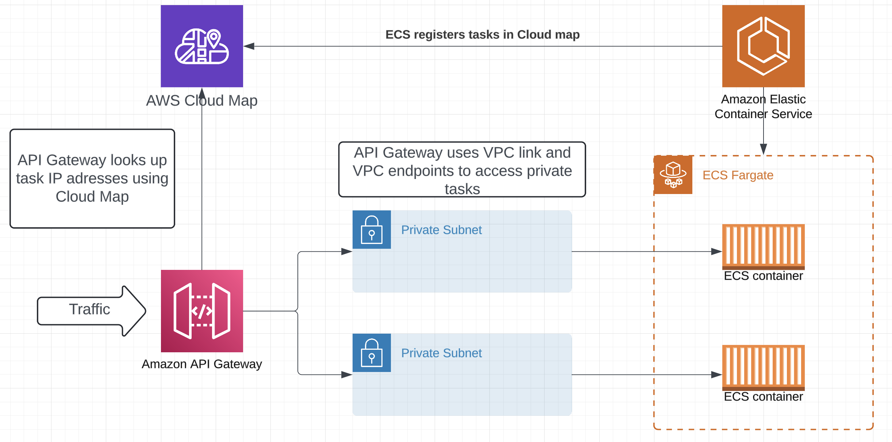

# apigateway-cloudmap-ecs-integration

# Overview

This project establishes a highly secure and scalable architecture that integrates an HTTP API Gateway with ECS Fargate. The key components include:

API Gateway: Serves as the primary entry point for all incoming HTTP requests, efficiently routing them to the backend services hosted on ECS Fargate.

ECS Fargate: Runs the containerized application tasks in a secure environment. These tasks are deployed within a private subnet, ensuring they are not exposed directly to the public internet.

AWS Cloud Map: Facilitates service discovery, enabling the API Gateway to dynamically locate and communicate with the ECS Fargate tasks. This setup allows for seamless routing to API endpoints without hardcoding IP addresses.

By leveraging AWS Cloud Map for service discovery, the architecture allows dynamic resolution of service endpoints, enhancing flexibility and maintainability. The entire stack is designed to ensure that backend services are securely isolated while remaining easily accessible via the API Gateway.

# Deployment Steps

1. Create ECR Repository: Create an Amazon ECR repository where Docker images of the application will be stored.

2. Build, Tag, and Push Docker Image:

- Navigate to application directory.
- Build, tag and push the Docker image to ECR repository.

3. Configure CDK (Cloud Development Kit):

- In cdk/bin/cdk.ts, replace the image field with the URI of the Docker image from your ECR repository.
- Customize resource names and other values as needed.

4. Deploy with CDK:

- Navigate to the cdk folder.
- Run cdk deploy to deploy the entire infrastructure, including the API Gateway, ECS Fargate tasks, and Cloud Map service.

# Requirements
AWS CLI
AWS CDK
Docker